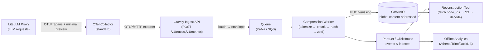
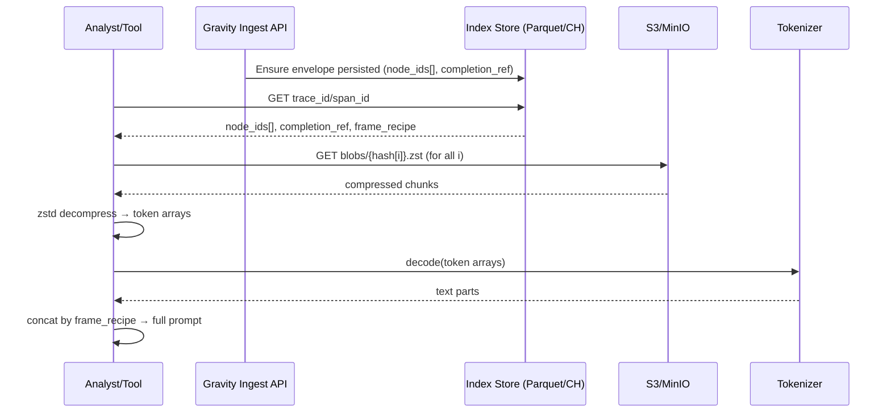

# OTel → Prompt‑DAG Data Flow (Visual)

## 1) End‑to‑End Flow


---

## 2) Data Contracts per Stage

### LiteLLM Proxy → OTel Collector (Spans)
- `attributes`: `org_id`, `model`, `route`, `prompt_tokens`, `cached_tokens`, `completion_tokens`, `latency_ms`
- `preview`: short string only (no full prompt)

### OTel Collector → Gravity Ingest API (OTLP/HTTP)
- Endpoints: `POST /v1/traces` and `POST /v1/metrics`
- Content-Type: `application/x-protobuf` (OTLP wire format)
- Auth/Tenant routing via headers (e.g. `x-org-id`) or resource attributes

### Gravity Ingest API → Queue (Envelope)
```json
{
  "org_id": "acme",
  "trace_id": "abcd-1234",
  "span_id": "efgh-5678",
  "provider": "openai",
  "model": "gpt-4o",
  "route": "chat/completions",
  "metrics": {"latency_ms":642,"prompt_tokens":187,"cached_tokens":0,"completion_tokens":23},
  "pointers": {"prefix_ptr": null, "prefix_preview": "You are a helpful..."},
  "timestamp": 1730123456789
}
```

### Worker (Core Logic)
- **Tokenize** with same tokenizer as model (e.g., `o200k_base`)
- **Chunk** by tokens (e.g., 1024/2048)
- **Hash** each chunk: `blake3(token_bytes)`
- **Compress**: `zstd` (dict per `{org, model}`)
- **Idempotent write**: `HEAD` → `PUT` to S3 only if missing
- **Emit** index row with ordered `node_ids[]`, `completion_ref`

### S3 Object Keys (Content‑Addressed, Long‑Term Source of Truth)
```
blobs/blake3/{org_id}/{hash[0:2]}/{hash}.zst        # prompt chunks
completions/{org_id}/{hash[0:2]}/{hash}.zst         # model completions (optional)
```

### Parquet / ClickHouse (Indexes & Events)
```json
{
  "trace_id": "abcd-1234",
  "span_id": "efgh-5678",
  "node_ids": ["hA","hB","hC"],
  "completion_ref": "hZ",
  "prompt_tokens": 187,
  "completion_tokens": 23,
  "latency_ms": 642,
  "cache_hit_ratio": 0.0,
  "frame_recipe": {
    "serializer": "openai_messages_v1",
    "tokenizer": "o200k_base",
    "messages": [
      {"role":"system","parts":[{"hash":"hA"}]},
      {"role":"user","parts":[{"hash":"hB"}]},
      {"role":"assistant","parts":[{"hash":"hC"}]}
    ]
  }
}
```

---

## 3) Reconstruction Path (Lossless)


**Properties**
- Tokenizer is lossless → exact text recovery
- Content‑addressed chunks → global dedupe
- No long‑term full JSON copies → storage minimized

---

## 4) What is (and isn’t) Stored Long‑Term
- ✅ **Store**: compressed, deduped chunks (`blobs/`), completion chunks, event/index rows
- ❌ **Don’t store**: full original request JSON per call (only short‑lived WAL/TTL if needed)

---

## 5) Optional: Temporary Safety (WAL/TTL)
- If desired, keep a short‑TTL raw envelope in `tmp-raw/` (24–72h)
- After successful chunking+indexing, GC removes temporary originals
