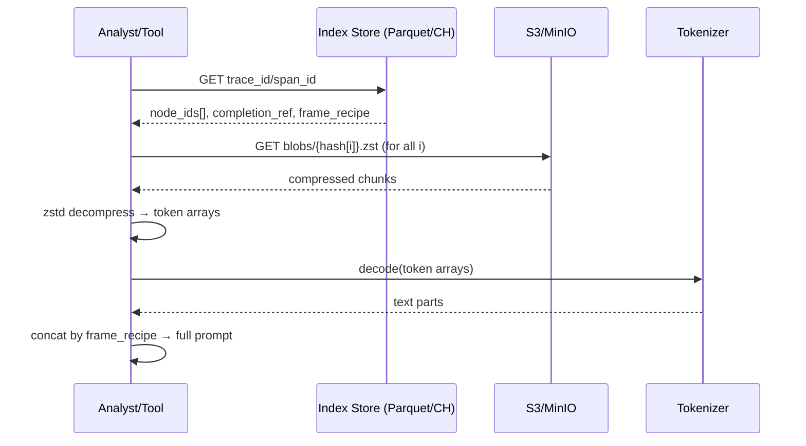

# OTel → Prompt‑DAG Data Flow (Visual)

## Background & Design Philosophy

### Why This System Exists

This system is designed as an **offline-first, compression-optimized alternative** to real-time LLM observability platforms like Langfuse. The core design priorities are:

1. **Cost Optimization Over Real-Time Latency**
   - Langfuse and similar tools buffer traces in-memory/databases for instant dashboards
   - We prioritize aggressive compression and deduplication, accepting seconds-to-minutes of processing delay
   - Storage costs reduced by 10-100x through content-addressed chunking and zstd compression

2. **Lossless Compression with Content-Addressed Storage**
   - LLM prompts contain massive repetition (system prompts, few-shot examples, context)
   - Tokenize → chunk → hash → deduplicate at the token level (not just string matching)
   - Store compressed chunks once, reference them many times across traces

3. **S3-First Architecture**
   - No expensive queue infrastructure (Kafka/SQS) for buffering
   - OTel Collector writes raw spans directly to S3 (cheap, durable, replayable)
   - Workers process batches from S3 at their own pace (backpressure-friendly)
   - Easy reprocessing when compression logic evolves

4. **Offline Analytics Focused**
   - Queryable indexes in Parquet/ClickHouse for aggregations and filtering
   - Full prompt reconstruction on-demand from content-addressed blobs
   - Use Athena/Trino/DuckDB for cost-effective batch analytics

### Key Tradeoff

- **Sacrificed**: Real-time dashboards and instant trace viewing (1-5 minute delay acceptable)
- **Gained**: 10-100x storage cost reduction, infinite replay capability, simple ops

---

## 1) End‑to‑End Flow
```mermaid
flowchart LR
  A[LiteLLM Proxy
  (LLM requests)] -->|OTLP Spans
  + minimal preview| B[OTel Collector
  with S3 exporter]
  B -->|batch writes
  raw spans| C[(S3: raw-spans/
  {org}/{date}/batch.json.gz)]
  C -->|S3 event notification
  → SQS or scheduled| D[Compression Worker
  (tokenize → chunk → hash → zstd)]
  D -->|PUT if-missing| E[(S3: blobs/
  content-addressed)]
  D --> F[Parquet / ClickHouse
  events & indexes]
  F --> G[Offline Analytics
  (Athena/Trino/DuckDB)]
  F --> H[Reconstruction Tool
  (fetch node_ids → S3 → decode)]
  E --> H
  C -.->|lifecycle: 30d TTL| I[Auto-cleanup]
```

---

## 2) Data Contracts per Stage

### LiteLLM Proxy → OTel Collector (OTLP Spans)
- Standard OTLP spans with `attributes`: `org_id`, `model`, `route`, `prompt_tokens`, `cached_tokens`, `completion_tokens`, `latency_ms`
- `preview`: short string only (no full prompt/completion in spans)
- Full request/response bodies in span events or resource attributes (depending on instrumentation)

### Collector → S3 (Raw Spans)
**File Path Pattern:**
```
s3://bucket/raw-spans/{org_id}/dt={YYYY-MM-DD}/hour={HH}/batch-{timestamp}.json.gz
```

**Content:** Batched OTLP JSON spans (gzip compressed)
```json
{
  "resourceSpans": [{
    "resource": {"attributes": [{"key": "org_id", "value": {"stringValue": "acme"}}]},
    "scopeSpans": [{
      "spans": [{
        "traceId": "abcd1234...",
        "spanId": "efgh5678...",
        "name": "llm.chat.completions",
        "attributes": [
          {"key": "llm.provider", "value": {"stringValue": "openai"}},
          {"key": "llm.model", "value": {"stringValue": "gpt-4o"}},
          {"key": "llm.usage.prompt_tokens", "value": {"intValue": 187}},
          {"key": "llm.usage.completion_tokens", "value": {"intValue": 23}},
          {"key": "llm.latency_ms", "value": {"intValue": 642}}
        ],
        "events": [
          {"name": "llm.request", "attributes": [{"key": "body", "value": {"stringValue": "{full request JSON}"}}]},
          {"name": "llm.response", "attributes": [{"key": "body", "value": {"stringValue": "{full response JSON}"}}]}
        ]
      }]
    }]
  }]
}
```

**Lifecycle:** 30-day TTL (delete after compression worker processes successfully)

### S3 → Worker Trigger Mechanisms

**Option A: S3 Event Notifications → SQS** (Recommended)
```
S3 PutObject event → S3 Event Notification → SQS Queue → Worker polls SQS
```
- Workers poll SQS for new S3 object keys
- Natural backpressure (workers process at their own pace)
- At-least-once delivery (idempotent processing required)
- Auto-scaling based on SQS queue depth

**Option B: Scheduled Batch Processing**
```bash
# Cron job every 5-15 minutes
aws s3 ls s3://bucket/raw-spans/*/dt=$(date +%Y-%m-%d)/ \
  --recursive | filter-unprocessed | xargs worker-process
```
- Simpler setup, slightly higher latency
- Good for initial MVP or low-volume scenarios

### Worker (Core Logic)
- **Tokenize** with same tokenizer as model (e.g., `o200k_base`)
- **Chunk** by tokens (e.g., 1024/2048)
- **Hash** each chunk: `blake3(token_bytes)`
- **Compress**: `zstd` (dict per `{org, model}`)
- **Idempotent write**: `HEAD` → `PUT` to S3 only if missing
- **Emit** index row with ordered `node_ids[]`, `completion_ref`

### S3 Object Keys (Content‑Addressed, Long‑Term Source of Truth)
```
blobs/blake3/{org_id}/{hash[0:2]}/{hash}.zst        # prompt chunks
completions/{org_id}/{hash[0:2]}/{hash}.zst         # model completions (optional)
```

### Parquet / ClickHouse (Indexes & Events)
```json
{
  "trace_id": "abcd-1234",
  "span_id": "efgh-5678",
  "node_ids": ["hA","hB","hC"],
  "completion_ref": "hZ",
  "prompt_tokens": 187,
  "completion_tokens": 23,
  "latency_ms": 642,
  "cache_hit_ratio": 0.0,
  "frame_recipe": {
    "serializer": "openai_messages_v1",
    "tokenizer": "o200k_base",
    "messages": [
      {"role":"system","parts":[{"hash":"hA"}]},
      {"role":"user","parts":[{"hash":"hB"}]},
      {"role":"assistant","parts":[{"hash":"hC"}]}
    ]
  }
}
```

---

## 3) Reconstruction Path (Lossless)


**Properties**
- Tokenizer is lossless → exact text recovery
- Content‑addressed chunks → global dedupe
- No long‑term full JSON copies → storage minimized

---

## 4) What is (and isn’t) Stored Long‑Term
- ✅ **Store**: compressed, deduped chunks (`blobs/`), completion chunks, event/index rows
- ❌ **Don’t store**: full original request JSON per call (only short‑lived WAL/TTL if needed)

---

## 5) OTel Collector Configuration

### S3 Exporter Setup

```yaml
# otel-collector-config.yaml
receivers:
  otlp:
    protocols:
      grpc:
        endpoint: 0.0.0.0:4317
      http:
        endpoint: 0.0.0.0:4318

processors:
  batch:
    timeout: 10s          # Buffer for 10s before writing
    send_batch_size: 100  # Or trigger at 100 spans

  memory_limiter:
    check_interval: 1s
    limit_mib: 512

  # Extract org_id for S3 partitioning (if not in resource attributes)
  attributes:
    actions:
      - key: org_id
        action: insert
        from_attribute: resource.org_id

exporters:
  awss3:
    s3uploader:
      region: us-west-2
      s3_bucket: your-traces-bucket
      s3_prefix: raw-spans

      # Partition by date and hour using strftime format
      # See https://man7.org/linux/man-pages/man3/strftime.3.html
      s3_partition_format: "dt=%Y-%m-%d/hour=%H"
      s3_partition_timezone: UTC

      # Format and compression
      marshaler: otlp_json     # Options: otlp_json, otlp_proto, sumo_ic, body
      compression: gzip        # Options: none, gzip

      # File naming
      file_prefix: "batch-"
      unique_key_func_name: uuidv7  # Optional: use UUIDv7 for file names

      # Storage class
      storage_class: STANDARD

    # Optional: Enable queuing for better throughput
    sending_queue:
      enabled: true
      num_consumers: 10
      queue_size: 1000

    # Retry configuration
    retry_mode: standard
    retry_max_attempts: 3
    retry_max_backoff: 20s

    timeout: 10s

  # Optional: Also send to logging for debugging
  logging:
    loglevel: info

service:
  pipelines:
    traces:
      receivers: [otlp]
      processors: [memory_limiter, batch, attributes]
      exporters: [awss3]

  # Optional: Enable health check and metrics
  extensions: [health_check, pprof]

extensions:
  health_check:
    endpoint: 0.0.0.0:13133
  pprof:
    endpoint: 0.0.0.0:1777
```

### S3 Bucket Structure

```
your-traces-bucket/
├── raw-spans/
│   ├── dt=2025-10-31/
│   │   ├── hour=14/
│   │   │   ├── batch-01931234-5678-7abc-9def-0123456789ab.json.gz
│   │   │   ├── batch-01931234-5679-7abc-9def-0123456789ab.json.gz
│   │   │   └── ...
│   │   └── hour=15/
│   │       └── batch-01931235-5678-7abc-9def-0123456789ab.json.gz
│   └── dt=2025-11-01/
│       └── hour=00/
│           └── ...
└── processed/
    ├── blobs/blake3/{org_id}/{hash[0:2]}/{hash}.zst
    └── completions/{org_id}/{hash[0:2]}/{hash}.zst
```

**Note:** The example above shows the basic structure. For multi-tenant scenarios,
you can use `s3_base_prefix` for environment separation and `resource_attrs_to_s3`
to dynamically route data by org_id. See the [official docs](https://github.com/open-telemetry/opentelemetry-collector-contrib/tree/main/exporter/awss3exporter)
for advanced configurations.

### S3 Lifecycle Policy (Example)

```json
{
  "Rules": [
    {
      "Id": "DeleteRawSpansAfter30Days",
      "Filter": {"Prefix": "raw-spans/"},
      "Status": "Enabled",
      "Expiration": {"Days": 30}
    },
    {
      "Id": "ArchiveBlobsToGlacier",
      "Filter": {"Prefix": "processed/blobs/"},
      "Status": "Enabled",
      "Transitions": [{
        "Days": 90,
        "StorageClass": "GLACIER_IR"
      }]
    }
  ]
}
```

---

## 6) Safety & Replay Capabilities

The S3-first architecture provides built-in safety and replay capabilities:

**Raw Spans as WAL (Write-Ahead Log)**
- `raw-spans/` in S3 serves as durable write-ahead log
- 30-day retention provides ample time for reprocessing
- If compression worker fails, data is never lost
- Can replay any date range on-demand

**Reprocessing Scenarios**
1. **Bug fixes**: Rerun worker with bug fix over historical data
2. **Algorithm improvements**: Test new chunking/compression on past traces
3. **Schema migrations**: Rebuild Parquet indexes with new structure
4. **Cost optimization**: Re-compress with better dictionaries after collecting more data

**Cost Comparison (Example)**
```
Scenario: 1M LLM requests/day, avg 1KB prompt + 200B completion
├─ Raw storage: 1.2 GB/day × $0.023/GB = $0.83/month (30 days)
├─ Compressed blobs: ~120 MB/day × $0.023/GB = $0.08/month (permanent)
└─ vs. Database storage: 1.2 GB/day × $0.25/GB = $9/month (ongoing)

Savings: ~90% vs traditional database buffering
```

---

## 7) Implementation Best Practices

### Worker Idempotency
Since S3 event notifications are at-least-once delivery, workers must be idempotent:
```go
func ProcessSpanFile(s3Key string) error {
    // 1. Check if already processed (query Parquet/ClickHouse by trace_id)
    if alreadyProcessed(s3Key) {
        return nil  // Skip gracefully
    }

    // 2. Download and parse spans
    spans := downloadAndParse(s3Key)

    // 3. Content-addressed storage is naturally idempotent
    for _, span := range spans {
        chunks := tokenizeAndChunk(span)
        for _, chunk := range chunks {
            hash := blake3(chunk)
            // HEAD then PUT only if missing
            if !s3.ObjectExists(hash) {
                s3.PutObject(hash, zstdCompress(chunk))
            }
        }
    }

    // 4. Write index row (use UPSERT or INSERT IGNORE)
    db.UpsertSpanIndex(span)
}
```

### Monitoring & Alerting
Key metrics to track:
- **OTel Collector**: Spans exported/s, S3 write errors, buffer utilization
- **S3**: Object count in `raw-spans/` (alert if growing too fast)
- **Workers**: Processing lag (time between S3 write and index update)
- **Compression ratio**: Track dedupe effectiveness over time

### Scaling Considerations
- **Write throughput**: OTel Collector can scale horizontally (stateless)
- **Read throughput**: Workers scale by SQS consumer count
- **S3 partitioning**: Use `org_id` + `date` + `hour` for parallel processing
- **Cost optimization**: Larger batch files = fewer S3 requests = lower costs

### Development Workflow
1. **Local testing**: Use MinIO instead of S3 for dev environment
2. **Replay testing**: Point worker at specific S3 prefix to reprocess
3. **A/B testing**: Run experimental compression alongside production
4. **Gradual rollout**: Process 1% of orgs first, validate, then scale

